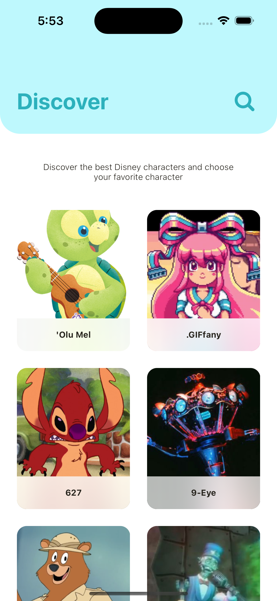
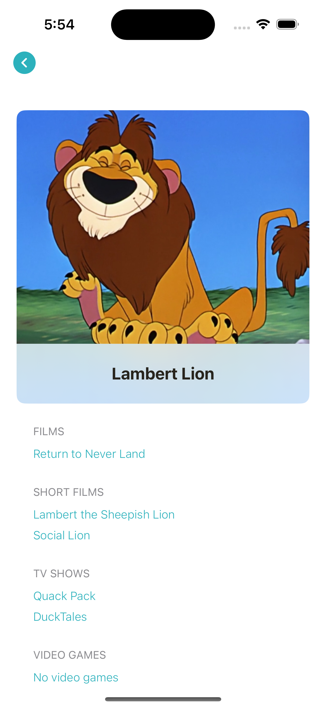
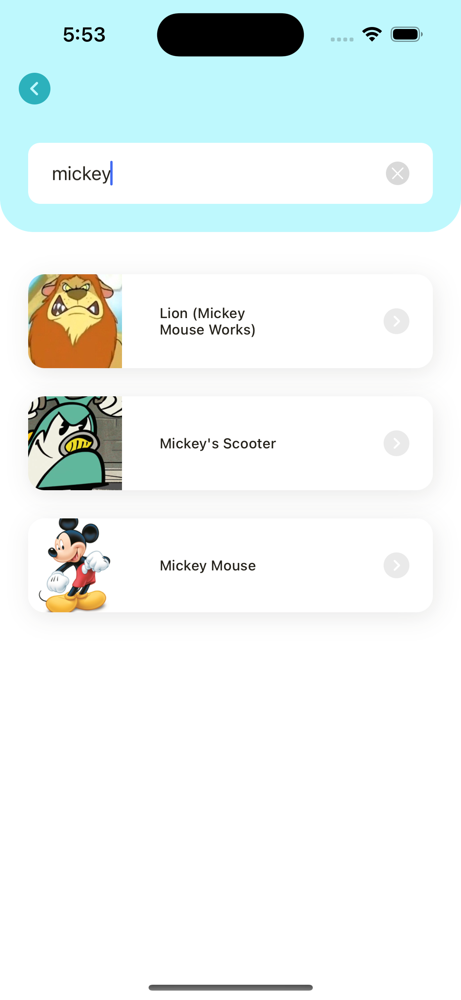

<a name="readme-top"></a>

<!-- PROJECT LOGO -->
<div align="center">
  <h1 align="center">Kartoon (with VIPER)</h1>
  <p align="center">Application that lists Disney's characters and contains detail information</p>
</div>

<!-- TABLE OF CONTENTS -->
<summary>Table of Contents</summary>
<ol>
  <li><a href="#about-the-project">About The Project</a></li>
  <li><a href="#screenshots">Screenshots</a></li>
  <li><a href="#built-with">Built With</a></li>
  <li>
    <a href="#getting-started">Getting Started</a>
    <ul>
      <li><a href="#prerequisites">Prerequisites</a></li>
      <li><a href="#installation">Installation</a></li>
    </ul>
  </li>
</ol>
<br />


<!-- ABOUT THE PROJECT -->
## About The Project

When the application is started, firstly, a screen with the pictures and names of the character is displayed. There is a scroll pagination on this screen. Each request brings 20 data of character.

By pressing any character from this screen, the screen will be displayed where the detail data of that character will be displayed. The application includes the Search screen, which can search for characters.

The application is built using the VIPER programming architecture.

Providers have been added to fulfill the responsibilities of TableView and CollectionView structures in the Controller in the application. Each provider performs the TableView or CollectionView operations it is responsible for and notifies the Controller with the help of an event.

The Alomafire library was used for service requests in the application.

Kingfisher library was used for downloading and caching images.

PromiseKit library was used for asynchronous programming.

<p align="right">(<a href="#readme-top">back to top</a>)</p>


<!-- SCREENSHOTS -->
## Screenshots

<div>
    
  
  
</div>
<br />

<p align="right">(<a href="#readme-top">back to top</a>)</p>


<!-- BUILD WITH -->
## Built With

* Swift, UIKit, VIPER
* Alomafire - Network requests
* Kingfisher - Image download and caches
* PromiseKit - Asynchronous programming

<p align="right">(<a href="#readme-top">back to top</a>)</p>


<!-- GETTING STARTED -->
## Getting Started

In order to run the application, the following steps must be followed.

### Prerequisites

The app's dependencies must be installed with CocoaPods. Therefore, CocoaPods must be installed on your local computer. The current Xcode version is required to run the project.

* CocoaPods installation on terminal
  ```sh
  sudo gem install cocoapods
  ```

### Installation

1. Clone the repo
   ```sh
   git clone https://github.com/oktaytan/Kartoon.git
   ```
2. Install Pods packages
   ```sh
   pod install
   ```
3. Run project with Xcode

<p align="right">(<a href="#readme-top">back to top</a>)</p>
